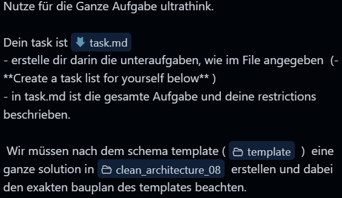

<!-- markdownlint-disable MD033 -->

## Instruction for 🤖 Agent

- **Take a look at:**
  > - [assignment (`devices.md`)](files/angabe/devices.md)
  > - [exercise project (`clean_architecture_06/`)](clean_architecture_06)
  > - [original reference project (`template/`)](files/template/)
  > - [data (`devices.csv`)](files/data.csv)

❗ ***Assignment has to be implemented in the [exercise project](clean_architecture_06)***

- 🛑 **Do not deviate from given patterns and code structures**
→ $\scriptsize\color{red}\text{strictly adhere to patterns \\& structures of given project/scriptum}$ ❗
- 🛑 **Do not implement new patterns or code structures**
→ $\scriptsize\color{red}\text{strictly adhere to patterns \\& structures of given project/scriptum}$ ❗
- 🛑 **Do not implement validations in wrong layers**
→ $\scriptsize\color{red}\text{strictly adhere to layers of given project/scriptum}$ ❗

---

- **Create a task list for yourself below:**
  - [ ] **Task 01** - ```<name_of_task>```:
    > - **Description:** ```<describe_task>```
    > - **Expected Result:** ```<describe_expectation>```
    > - **Notes:** ```<describe_notes>```
  - ⚠️ ... <kbd>EXTRAPOLATE HERE</kbd> ...
  - [ ] **Task n** - taskname:
    > - **Description:**
    > - **Expected Result:**
    > - **Notes:**

---

<div align="center">



</div>
