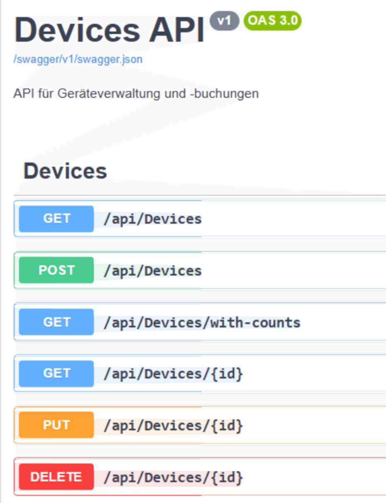
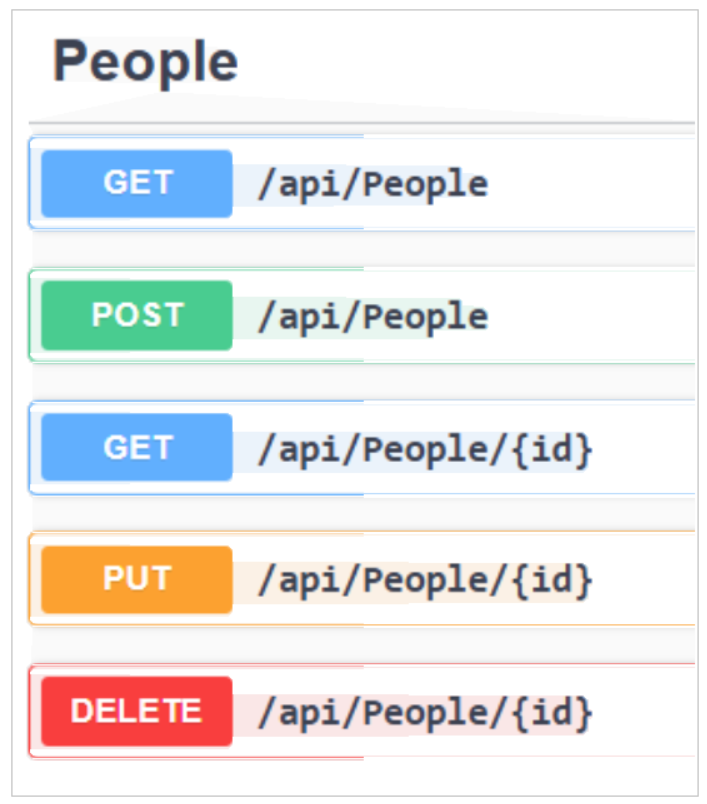
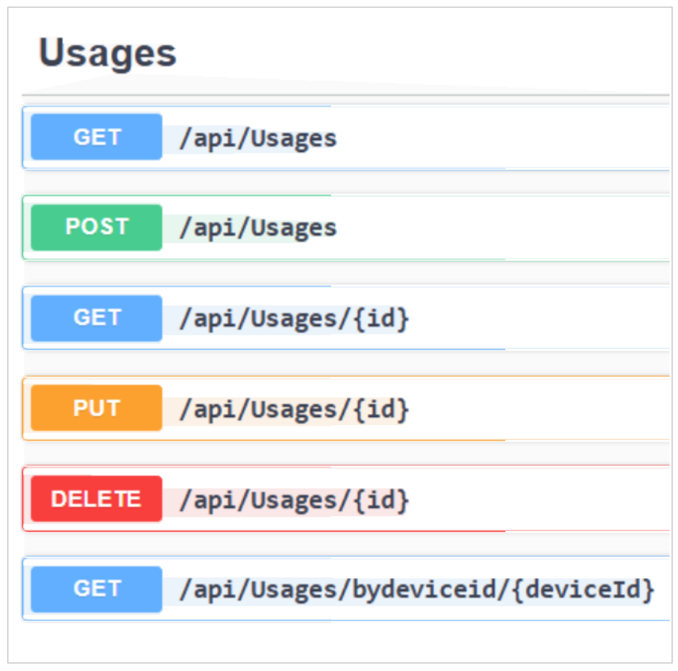

<!-- markdownlint-disable MD033 -->

## Devices (API)

## Lehrziele

- Fullstackanwendung mit REST-Interface
- Validierung

Es ist eine einfache Verwaltung von technischen Endgeräten (`Smartphone`, `Notebook`, `Tablet`) zu implementieren.

Im Zentrum der Anwendung steht die Nutzung (Class `Usage`) von Geräten (`Device`) durch Personen (`Person`).

Der Gerätetyp ist als Enum zu verwalten (`Tablet`, `SmartPhone`, `Notebook`).

Für die Abfrage von Gerätenutzungen und dem Eintragen von neuen Nutzungen oder deren Änderung ist eine **REST**-Schnittstelle mit Swagger als UI zu erstellen.

Die Architektur orientiert sich an der in den letzten Wochen entwickelten **CleanArchitecture** mit **CQRS**-Pattern.

Der automatische Datenimport erfolgt wieder über den `StartupDataSeeder`.

Die Definition der Datenbankstruktur erfolgt im `AppDbContext` über `OnModelCreating()`.
**Migration** und **Update-Database** sind händisch auszuführen.

  

### Validierung

#### Validierung einer Usage

- Beim Anlegen einer neuen `Usage` ist darauf zu achten, dass diese für ein Gerät sich nicht mit anderen Buchungen überlagert.

- Usages werden auf Datumsbasis und nicht auf Zeitbasis verwaltet.

- Es darf auch nicht am Tag der Rückgabe eine neue Usage beginnen.

- Natürlich darf das `To`-Datum nicht vor dem `From`-Datum liegen.

- Die `Person` und das `Device` für das `Usage` müssen bereits vorhanden sein.

- Usages können natürlich nur für die Zukunft gebucht werden (Use Case) und das Rückgabedatum muss hinter dem `From`-Datum liegen.

- Das gleiche gilt auch bei der Änderung von Usages.

- Beim Datenimport gilt diese Einschränkung natürlich nicht.

- Überprüfen Sie die Korrektheit Ihres Codes an Hand der demonstrierten Beispiele.

- Ihre Implementierung soll die gleichen Fehlermeldungen bringen.

#### Validierung eines Devices

- Der Devicename darf nicht leer sein und muss aus mindestens zwei Buchstaben bestehen.
- Die Seriennummer darf ebenfalls nicht leer sein und muss aus mindestens drei Zeichen bestehen.

#### Validierung einer Person

Kein Feld darf leer sein. Die Mailadresse muss syntaktisch korrekt sein. Die Mailadresse darf nur einer Person vorkommen und dient als Identifikationsmerkmal.

### Swagger

Die API bietet für alle drei Entitätstypen die CRUD-Funktionalitäten an. Der Endpoint /api/devices/with-counts gibt die Geräte mit der Anzahl von Buchungen aus.

  

